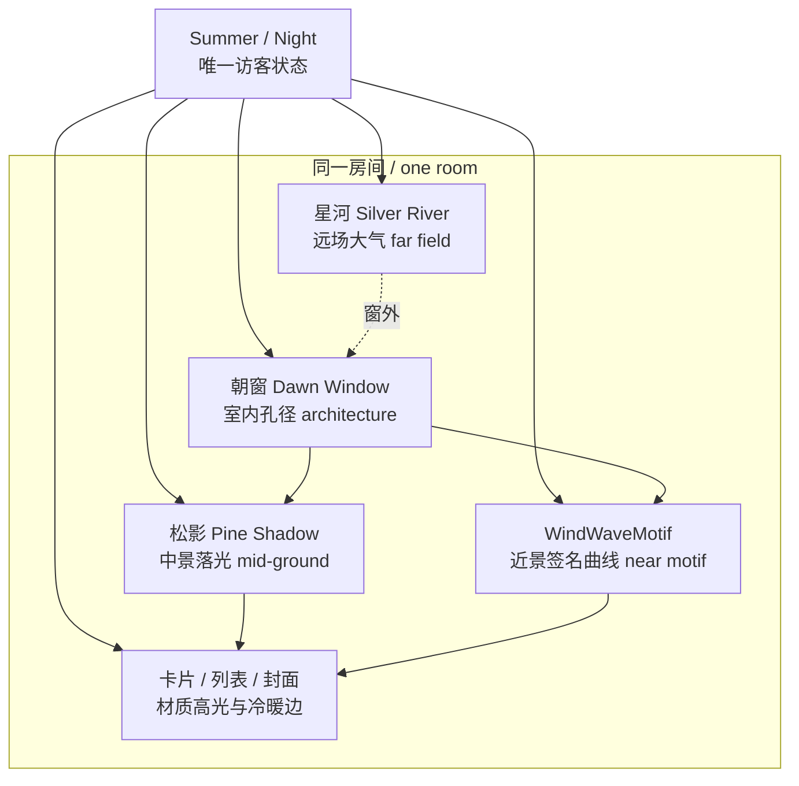
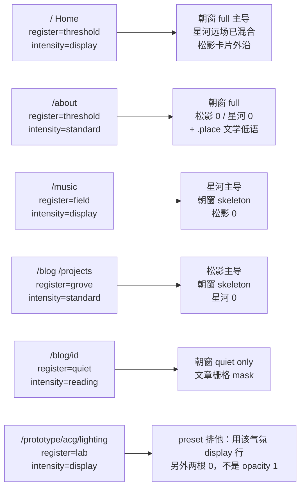
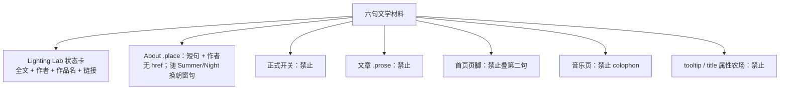
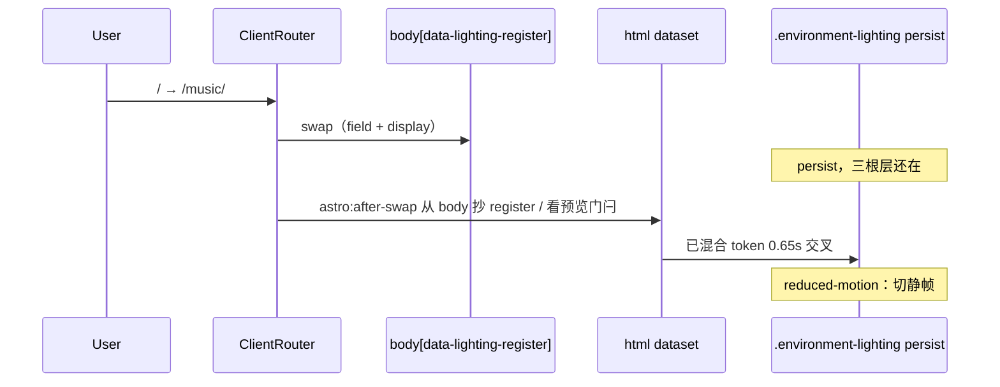
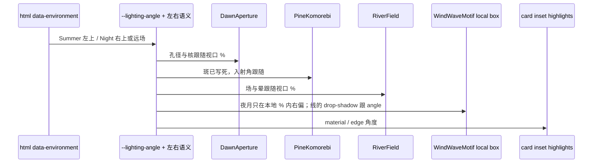

# 文学空间光：朝窗 · 松影 · 星河作为一套空间哲学

| 字段 | 值 |
| --- | --- |
| 文档标题 | Literary Spatial Lighting — 朝窗 / 松影 / 星河 |
| 作者 | design-doc-writer |
| 日期 | 2026-08-24 |
| 状态 | Ready for implementation |
| 作用范围 | `E:\blog\astro-blog`（nabunana Astro 个人博客） |
| 相关系统 | `EnvironmentLighting.astro`、`WindWaveMotif.astro`、`DESIGN_LANGUAGE.md` §11、`src/lib/environment.ts` |

---

## Overview

当前全站环境光把三份文学材料做成了**同一棵 DOM 上的透明度开关**：访客正式方案锁死 `dawn-window`，`pine-shadow` / `silver-river` 只活在比较器里；QA 后又把整层透明度砍半，Summer `display` 只剩 `--lighting-layer-opacity: .08`。结果是双重失败——既像 CSS 教程里的径向光斑，又淡到几乎感觉不到“被设计过的空间”。

本方案把三份材料升格为**同一间屋子的三个空间音域（spatial registers）**，而不是三套皮肤，也不是访客换装盘：

- **朝窗** = 室内孔径（architecture of light）
- **松影** = 中景落在留白与卡片边缘的木漏日
- **星河** = 窗外远场大气

访客控件仍然只有 Summer / Night。页面按职能选择主导音域，朝窗作为建筑骨架始终在场，但朝窗有三张明确的**图纸**（full / skeleton / quiet），不是把同一份 SVG 乘一个 mix 系数。`.environment-lighting` **persist 跨 `ClientRouter` 行走**，层与层用 0.65s opacity 交叉，禁止硬切，禁止 `display: none` 切断过渡。强度用已经混合好的 token，父级 opacity **锁死为 1**，废除 50% 全局淡化。Home Summer 必须能被感觉成房间：display 主导层约 `.20–.24`，炙热核约 **22vmax**。

文学短句只出现在 Lighting Lab（全文 + 链接）和 About 正文里的一句低语。不进首页页脚、不进音乐页、不进开关、不进文章。

---

## Background & Motivation

### 现有设计语言已经说对的部分

`DESIGN_LANGUAGE.md` 的位置判断仍然有效：60% 功能、40% 气氛；关键词是清澈、克制、文学、夏日、海、风。签名图形是 `WindWaveMotif.astro` 的风/海/波形有机曲线（8s–20s），不是环境光。环境状态模型也已经正确：

```
html[data-environment="summer|night"]
html[data-lighting-preset="dawn-window|pine-shadow|silver-river"]
body[data-lighting-intensity="display|standard|reading"]
```

正式访客控件只暴露 Summer / Night，偏好写入 `nabunana:environment-v1`。`BaseLayout.astro` 的 inline script 把 `data-lighting-preset` 硬编码为 `'dawn-window'`。比较器在 `/prototype/acg/lighting/`，通过 `nabunana:environment-preview` 和 URL `?lightingPreset=&environment=` 做预览，不写正式偏好。这些产品边界应当保留。

注意：比较器链接会带 `lightingPreview=1`，但 `setupEnvironment` **今天并不读取这个 flag**——任何合法 `?lightingPreset=` 都会生效。本方案把它做成真正的门闩（见 API）。

### 失败的机制，而不是失败的愿望

`EnvironmentLighting.astro`（约 248 行）始终挂载全部图层：

```
.lighting-haze
.lighting-source
.lighting-ray
.lighting-window
.lighting-dust
.lighting-foliage   (7 个 ellipse + 2 个 path 元素 / 4 条 subpath)
.lighting-galaxy
.lighting-stars     (5 个 radial-gradient 点)
.lighting-water     (6 条 path + stroke-dashoffset)
```

预设几乎只改 CSS 变量。`pine-shadow` 与 `silver-river` **没有**设置 `--lighting-haze-opacity` 等层透明度，因此继承 `:root` 默认值 `0`；但 `.lighting-source` 与 `.lighting-ray` 不受这些 token 控制，它们始终绘制。这就是“三个名字、一种语法”的根因：无论叫什么，页面上都是 **68vmax 的径向圆盘 + 线性光柱**，松影只是叠了椭圆树，星河只是叠了旋转椭圆和五个点。

朝窗窗棂是 `repeating-linear-gradient` 的硬条；松叶是 `ellipse`；银河是 `border-radius: 50%` 的扁椭圆；星星是五颗 1px 点；水纹用 `stroke-dashoffset: -238` 走 loader 式循环。这些都是 CSS 教程套路，和 `WindWaveMotif` 里那条 1.2px 有机曲线不在同一个手艺等级。

`.environment-lighting` **没有** `transition:persist`。开关有 `transition:persist="environment-controller"`，播放器有 `transition:persist="nabunana-music-player"`。环境层坐在 `body` 里，每次 `ClientRouter` 导航都随 `BaseLayout.astro` L75 重挂。仓库里没有 `::view-transition-*` 规则，默认是整页快照溶解——两张照片，不是走进下一间房。

### 50% 全局淡化把“拙”变成了“无”

`DESIGN_LANGUAGE.md` §11 记录：复杂朝窗验收后整体淡化 50%。代码与文档一致：

| 环境 | display | standard | reading |
| --- | --- | --- | --- |
| 淡化前（`body[data-lighting-intensity]` 基线） | `.19` / 材质 `13.8%` / 边缘 `22.4%` | `.121` / `8.6%` / `15.5%` | `.072` / `5.2%` / `10.4%` |
| Summer 现行 | `.08` / `5.85%` / `9.5%` | `.0515` / `3.65%` / `6.6%` | `.0305` / `2.2%` / `4.4%` |
| Night 现行 | `.065` / `4.8%` / `7.85%` | `.04` / `3%` / `5.25%` | `.0225` / `1.9%` / `3.6%` |

朝窗 Summer 的内层还有 `--lighting-haze-opacity: .36`、`--lighting-window-opacity: .44`。有效雾层 ≈ `0.08 × 0.36 = 0.029`。与此同时 `.lighting-source` 核心是 `rgb(var(--lighting-highlight)/.92)`、尺寸 `68vmax`——一个几乎占满视口的暖色圆盘，被父级 8% 压成一团说不清的黄雾。淡化解决的是“太吵”，代价是“空间消失”；它没有解决圆盘语法本身。

**大胆不是把 68vmax 圆盘调回 `.19`。** 大胆是删掉圆盘，让 22vmax 热核和纸门遮挡以 display `.20–.24` 的存在感站在房间里。形状对了之后，禁止再乘 0.5。

### Motif 与光没有共享一个空间

`WindWaveMotif.astro` 的月亮永远在 `cx="566" cy="112"`（viewBox 720×420 的右上），Summer 也不隐藏，opacity `.2` 日夜相同；波形动画 15s / 19s / 17s。首页 Hero 另有 6px × 4px 的 motif 视差（`AcgHome.astro`，且 gated 在 `pointer:fine`）。环境光视差却是桌面 8px / 触摸 4px（`EnvironmentLighting.astro` 的 `--light-shift-x/y`，**没有** `pointer:fine`），与设计语言 §8 的 2px–6px 也不一致。底部 `.lighting-water` 用 dashoffset 再画一遍水，和 motif 抢同一语义。光、窗、波、月目前是四套互不相认的装饰。

SVG `cx` 不能消费 `%` token。即使把 `--lighting-source-x: 12%` 塞给月亮，那也是**页面视口**坐标；motif 住在 Hero 右栏，盒子不是视口。同向必须在 **motif 本地坐标系**里完成。

### 页面强度已经按职能分配，但光的内容没有

| 页面 | 现行 intensity | 现行预设 |
| --- | --- | --- |
| `/`、`/music/`、原型 ACG / lighting | `display` | 始终 `dawn-window` |
| `/blog/`、`/projects/`、`/about/`、`/prototype/`、minimal/product/dev | `standard`（默认） | 始终 `dawn-window` |
| `/blog/[id]/` | `reading` | 始终 `dawn-window`；Night 阅读底 `#122a27` |

强度阶梯是对的。缺的是：首页、音乐页、文章列表在空间上应当不是同一扇窗的同一张照片。

`DESIGN_LANGUAGE.md` §3 Night 底色仍写 `#071816`；实装与 §11 是 `#102724`（`tokens.css` / `.acg-site`）。改写 §11 时必须顺手改 §3，避免语言文件自己打架。

---

## Goals & Non-Goals

### Goals

1. 让三份文学材料成为**一套空间哲学**：孔径 / 中景 / 远场，而不是三套可替换皮肤。
2. 恢复“被设计过的房间”的可感知度。删掉 68vmax 圆盘 **并且** 把 display 主导层抬到 **`.20–.24`（Summer）/ `.16–.20`（Night）**。可见度来自形状 + 足够的存在感，不是来自把 blob 调亮，也不是来自另一轮全局淡化。
3. 发布**一条**合成公式，以及一张 register × 气氛 × intensity 的**已经混合好**的 token 表。朝窗必须有 full / skeleton / quiet 三张图纸，禁止用 mix 系数去发明图纸。
4. 用具体手艺替换教程套路：纸窗遮挡（坐标写死）、木漏日光斑（坐标写死）、山际晨雾 / 乳白银河薄雾。
5. 让 `WindWaveMotif` 与环境光共享同一**方向**（motif 本地框，不是把视口 `%` 塞进 SVG `cx`）。
6. 文学短句进入界面时保持克制：Lab 全文，About 一句，别处为零。
7. 拆分过大的 `EnvironmentLighting.astro`；三子树 persist，用 opacity 行走，闲置层不 `will-change`。
8. 改写 `DESIGN_LANGUAGE.md` §11（及 §3 Night 色值），使之与本方案一致。
9. `ClientRouter` 换房是 0.65s 交叉淡化，不是硬切，也不是整页快照溶解冒充行走。

### Non-Goals

- 不向访客提供三预设选择器，也不把 Summer / Night 扩成 3×2 矩阵。
- 不引入 Canvas / WebGL / 粒子引擎 / 视频背景 / 大尺寸贴图。
- 不绘制拟人化的太阳或月亮，不恢复霓虹 glow。
- 不把诗句做成 tooltip 农场、开关标签、文章页装饰、首页第二句、音乐页 colophon。
- 不在本次重做唱片廊、播放器或导航信息架构。
- 不修改 `nabunana:environment-v1` 的存储语义（仍然只存 `summer|night`）。
- 不把原型站 `product` / `dev` 的文学光打开（它们继续走各自的 token；气氛层隐藏）。
- 不在 v1 做逐字形、逐 `h2`、随滚动的 clip。阅读保护是视口固定的**文章栅格** mask（desktop：720 + 5rem + 180，居中于 1180 容器；≤900px 收成 720；≤800px 关洞）。

---

## Key Decisions

1. **三材料 = 空间音域，不是皮肤。** 朝窗是建筑孔径，松影是中景落光，星河是远场大气。同一房间的远、中、近，而不是三个 WordPress 主题。理由：现行失败正是“一棵 DOM、三种 opacity”；再做访客三选一只会把哲学做成换装。

2. **访客控件保持两枚按钮。** `.environment-switcher` 仍为 `光景 / Summer / Night`。`pine-shadow` 与 `silver-river` 从“比较器专用皮肤”晋升为生产图层，但**不**晋升为生产选择。理由：正式站的唯一亮暗状态已经是 Summer / Night（§11）；再加预设选择器会变成铬饰，并与“克制”直接冲突。

3. **页面音域（register）决定主导层与朝窗图纸，朝窗始终作为骨架在场。** 新增 `data-lighting-register`：`threshold | grove | field | quiet | lab`。Home / About 用朝窗 **full**；Writing / Projects 用朝窗 **skeleton** + 松影主导；Music 用朝窗 **skeleton** + 星河主导；文章页用朝窗 **quiet**。理由：首页是窗边，音乐是远方，写作是树下——职能不同，但必须仍是同一座房子。

4. **废除 50% 全局淡化；存在感有数字地板。** 删除 68vmax 圆盘，display 主导层 Summer **`.20–.24`**、Night **`.16–.20`**，standard **`.12–.16`**，reading **`.06–.09`**。炙热核 **~22vmax**，local `.40–.50`。Home Summer 热核有效值（父级 1 × dawn-layer × heat-core local）**≥ `.08`**；full 孔径梃有效值 **≥ `.05`**。禁止再乘 0.5。Night 低于 Summer，不把日光数字抄给月光。理由：圆盘语法是病，淡化是错药；删盘之后再淡就是把房间关掉。

5. **图层按音域挂载，闲置层 opacity 0、不 `will-change`，过渡期间禁止 `display: none`。** 拆成 `DawnAperture` / `PineKomorebi` / `RiverField`。朝窗 full/skeleton/quiet 的热核、尘埃、水、梃 2、横档同样始终挂载，用 register CSS 走 0.65s opacity，不靠 `data-dawn-drawing` 卸树。删除 `.lighting-source` 圆盘、`.lighting-ray` 光柱、五颗星星、椭圆树、dashoffset 水。理由：`display: none` 不能过渡，会把房子走成硬切；opacity 0 且无 `will-change` 已够 GPU 预算。

6. **文学短句只出现在 Lab 与 About 正文。** 开关旁零诗句；文章正文零诗句；首页页脚保持既有「また、どこかで。」不另加诗；音乐页不加 colophon。About 低语放在 `.place`：**短句 + 作者**（等宽、opacity `.55`），无 href。理由：用户把短句升格为哲学，不等于把短句做成 UI chrome。

7. **两套运动时钟分离。** 交互 180–320ms / 2–6px；motif 8–20s；天气 45–90s / 数像素。天气视差桌面 **4px**、触摸 **2px**（不关闭）。`prefers-reduced-motion` 冻结天气但保留静态构图。理由：被看成动画就已经失败。

8. **`data-lighting-preset` 降为 Lab 排他预览。** 生产页写 `data-lighting-register`。URL `?lightingPreset=` **只有**在 `lightingPreview=1` 或当前 register 已是 `lab` 时才覆盖。离开预览 URL 必须把 SSR register 写回。理由：保留比较器工作流，同时停止把 preset 当作站点身份。

9. **光的舞台 persist，房子才能走。** `.environment-lighting` 使用 `transition:persist="environment-lighting"`（与播放器、开关同一模式）。`astro:after-swap` 从新 `body[data-lighting-register]`（及 intensity）抄到 `html`，再让三根层的 opacity 走 0.65s `--ease`。`body[data-lighting-intensity]` 已经随页变化，层 token 必须 `transition: opacity .65s`，避免 display→reading 啪地一声。理由：不 persist 的层随 body 死，无论 mix 写多慢都是硬切。

10. **合成只有一条公式，token 已经混合。** 父级 `.environment-lighting { opacity: 1 }` 锁死。`--lighting-dawn-layer` / `--lighting-pine-layer` / `--lighting-river-layer` 是 register×environment×intensity 查表结果，**不是**再乘 `lightingRegisterMix` 的运行时系数。`lightingRegisterMix` 只是设计意图备忘。朝窗三图纸由 register 选择，不由 0.25 这种小数去“变瘦”。理由：mix × recipe × parent 会在 Home 上把 `.22 × 0.70` 送回 ~8%；不乘则三层全开会洗黄/洗紫。查表消掉这两种失败。

---

## Proposed Design

### 空间模型：一间屋子，三层景深



访客永远在室内。朝窗决定光从哪里进来、窗棂如何遮挡。松影是光穿过室外植被后落在纸面与卡片切口上的痕迹。星河是窗外的天气——晨雾或银河——透过纸门被看见，而不是贴在桌面上的壁纸。`WindWaveMotif` 是房间里的近景器物（风、水、声），必须服从同一光源方向，而不是另画一个月亮。

这个模型直接翻译文学：

| 材料 | 空间职责 | 短句如何变成形状 |
| --- | --- | --- |
| 朝窗 | 孔径、遮挡、室内温度 | 「大きな赤い日」= 一处炙热核，不是满屏朝霞；「皎皎空中孤月轮」= 银白清水洗，不是月亮角色 |
| 松影 | 落在空白上的疏影 | 「迟日江山丽」= 木漏日斑；「明月松间照」= 银色针状疏影。都不画树 |
| 星河 | 远场、距离、安静 | 「春はあけぼの」= 山际由紫雾转暖的一处日晕；「ぼんやりと白い銀河」= 乳白薄雾，几乎无星 |

### 为什么不做访客三选一

比较器页脚已经写明：“最终站点只保留被选中的一套光影，不向访客提供三套风格选择。”这句话的产品判断仍然对，错的是“只保留一套皮肤”。正确的升级是：**三套都留下，但作为空间层，而不是作为选项。**

三选一会把首页变成换壁纸游戏；会逼诗句进入开关；会让音乐页在访客选了朝窗之后“光对了、场错了”。音域映射把选择权交给页面职能——这是编辑判断，不是用户偏好。

### 合成公式（唯一公式）

```text
painted = 1
        × atmosphereRootOpacity[register, environment, intensity]
        × localLayerAlpha
        × gradientOrSvgAlpha

atmosphereRootOpacity ∈ { --lighting-dawn-layer, --lighting-pine-layer, --lighting-river-layer }
```

约束：

1. **父级锁死。** `.environment-lighting { opacity: 1; }`。废弃把 `--lighting-layer-opacity` 当作整层旋钮。intensity 只通过查表改变三根 `--lighting-*-layer` 和图纸 locals。
2. **禁止运行时再乘 mix。** `lightingRegisterMix` 不写进 CSS `opacity: calc(var(--recipe) * var(--mix))`。
3. **禁止再乘 0.5。** 删除 `EnvironmentLighting.astro` L188–193 那六条 environment×intensity 覆盖。过渡期（PR 3–5）它们可以作为**临时帽**留在旧名 `--lighting-layer-opacity` 上；新手艺只写 `--lighting-dawn-layer` 等新名。PR 7 摘帽，父级归 1。
4. **朝窗图纸不靠小数发明。** register CSS 选择 full / skeleton / quiet 的**子层 opacity**（同一棵 persist 树），而不是把 full SVG 乘 0.25，也不是卸节点。
5. **Wash / mist 的 gradient stop 近不透明。** `gradientOrSvgAlpha` 只描述形状衰减（核边缘落到 0），不把整场再乘 `.08`。河层紫帽：`violetStop × river-layer ≤ .08`。Music field 上 35% painted ≥ `.05`。

有效值例子（Home / threshold / Summer / display / full）：

| 层 | root | local | 有效 | 地板 |
| --- | --- | --- | --- | --- |
| 主导洗（dawn-layer 本身的存在感） | `.22` | — | `.22` | display Summer ∈ `.20–.24` |
| 炙热核 | `.22` | `.45` | `.099` | ≥ `.08`（22vmax 核内） |
| 纸门梃 | `.22` | `.36` | `.079` | ≥ `.05` |

Night 同源结构，数字更低（见已混合表）。不得把 Summer 行抄到 Night。

### 朝窗三张图纸

| 图纸 | 谁用 | opacity 1（相对该子层 local） | opacity 0（仍挂在 persist 树上，0.65s 走下来） |
| --- | --- | --- | --- |
| **full** | `threshold`（Home display、About standard）；`lab` + dawn-window | 软障子 3 竖 + 1–2 横、wash、Summer 22vmax 热核 + 尘埃（display only）、Night 银洗 + 底缘水（display only） | 圆盘、光柱、树、星——那些类根本不存在 |
| **skeleton** | `grove`、`field` | 梃 1（14%）与梃 3（71%）残影；可选横档 1 半透明；wash 更弱 | **热核、尘埃、水、梃 2（39%）、横档 2（58%）opacity → 0** |
| **quiet** | `quiet` 文章页，以及未知 register 回退 | 洗 + 梃 1 / 梃 3 鬼影 | 热核、尘、水、梃 2、两条横档 → 0；松影/星河根 → 0 |

「不画」= 子层 `opacity: 0` + 同一 `transition: opacity 0.65s var(--ease)`，**不是** `display: none`，也不是卸节点。Home full → Music skeleton 时 22vmax 核必须淡出，不能随图纸开关啪地消失。图纸只由 `body[data-lighting-register]`（外加 intensity / environment）的 CSS 驱动，**不**另设 `data-dawn-drawing` JS。

Music 的「纸门残影，不夺唱片」= **skeleton**，不是 full × 0.25。Grove 的「软孔径仍在」= **skeleton**。文章「只有洗与极淡窗影」= **quiet**。

### 页面音域映射

新增 `LightingRegister`。`BaseLayout` 以 prop 写入 `<html data-lighting-register>` **和** `<body data-lighting-register>`（body 随 ClientRouter 换页；html 持久，必须在 `astro:after-swap` 从 body 抄回）。intensity 管多少，register 管哪张图纸与哪根层非零。



意图备忘（**不是运行时乘数**；已混合进下表）：

```ts
export const lightingRegisterMix: Record<
  Exclude<LightingRegister, 'lab'>,
  { dawn: number; pine: number; river: number; dawnDrawing: 'full' | 'skeleton' | 'quiet' }
> = {
  threshold: { dawn: 0.70, pine: 0.10, river: 0.20, dawnDrawing: 'full' },
  grove:     { dawn: 0.40, pine: 0.60, river: 0.00, dawnDrawing: 'skeleton' },
  field:     { dawn: 0.25, pine: 0.00, river: 0.70, dawnDrawing: 'skeleton' },
  quiet:     { dawn: 1.00, pine: 0.00, river: 0.00, dawnDrawing: 'quiet' },
};
```

Lab 排他仍走**同一张已混合表**，不是第二套合成。`data-lighting-preset` 选出哪一根非零；非零根取该气氛的 **display** 行（`.20–.24` / `.16–.20`），另外两根为 **0**。禁止把排他根写成 opacity `1`（`1 × .45` 热核 = 橙页，Acceptance 2 / 12 失败）。朝窗排他用 full 图纸；松影排他用完整 10 斑 / 6 针（无朝窗核）；星河排他用 field-wash + halo（无朝窗）。

#### 已混合 token 表（CSS 唯一真相）

父级恒 1。选择器绑在 `html[data-environment] body[data-lighting-register][data-lighting-intensity]`（见实现节），不绑在会 persist 的 `:root`  alone。

**Summer**

| Register | Intensity | 图纸 | `--lighting-dawn-layer` | `--lighting-pine-layer` | `--lighting-river-layer` |
| --- | --- | --- | --- | --- | --- |
| `threshold` | display | full | **`.22`** | `.08` | `.05` |
| `threshold` | standard | full | `.16` | `0` | `0` |
| `grove` | standard | skeleton | `.12` | **`.14`** | `0` |
| `field` | display | skeleton | `.10` | `0` | **`.22`** |
| `quiet` | reading | quiet | `.08` | `0` | `0` |
| `lab` + `dawn-window` | display | full | **`.22`** | `0` | `0` |
| `lab` + `pine-shadow` | display | — | `0` | **`.22`** | `0` |
| `lab` + `silver-river` | display | — | `0` | `0` | **`.22`** |
| 回退 / 未声明 | standard | quiet | `.10` | `0` | `0` |

**Night**（一律低于 Summer **同一格**；Home 远场 `.04` < Summer `.05`，月光由朝窗银洗承担，不靠把河层抬过白天）

| Register | Intensity | 图纸 | `--lighting-dawn-layer` | `--lighting-pine-layer` | `--lighting-river-layer` |
| --- | --- | --- | --- | --- | --- |
| `threshold` | display | full | **`.18`** | `.06` | `.04` |
| `threshold` | standard | full | `.14` | `0` | `0` |
| `grove` | standard | skeleton | `.10` | **`.12`** | `0` |
| `field` | display | skeleton | `.08` | `0` | **`.18`** |
| `quiet` | reading | quiet | `.07` | `0` | `0` |
| `lab` + `dawn-window` | display | full | **`.18`** | `0` | `0` |
| `lab` + `pine-shadow` | display | — | `0` | **`.18`** | `0` |
| `lab` + `silver-river` | display | — | `0` | `0` | **`.18`** |
| 回退 / 未声明 | standard | quiet | `.08` | `0` | `0` |

Home display Summer `.22` 落在 `.20–.24`。Music 星河 `.22` 是远场的主导存在感。**Home 第一轮就交付** threshold display 的极淡河层（Summer `.05` / Night `.04`），不作为 follow-up。Grove 生产页是 standard `.14` / `.12`。松影的 **display** 行是 `lab` + `pine-shadow`（`.22` / `.18`，完整 10 斑或 6 针、dawn/river = 0）。文章 quiet `.08` / Night `.07` 落在 reading `.06–.09`。

#### 全路由表

凡走 `BaseLayout` 的页面都挂 `EnvironmentLighting`。下表是权威映射。

| 路径 | 文件 | intensity | register | 气氛层 |
| --- | --- | --- | --- | --- |
| `/` | `src/pages/index.astro` | `display`（已有） | `threshold` | 开 |
| `/about/` | `src/pages/about.astro` | `standard` | `threshold` | 开 |
| `/music/` | `src/pages/music.astro` | `display`（已有） | `field` | 开 |
| `/blog/` | `src/pages/blog/index.astro` | `standard` | `grove` | 开 |
| `/projects/` | `src/pages/projects.astro` | `standard` | `grove` | 开 |
| `/blog/[id]/` | `src/pages/blog/[id].astro` | `reading`（已有） | `quiet` | 开 + 文章栅格 mask（720 + 5rem + 180） |
| `/prototype/acg/` | `src/pages/prototype/acg.astro` | `display` | `threshold` | 开 |
| `/prototype/acg/music/` | `src/pages/prototype/acg/music.astro` | `display` | `field` | 开 |
| `/prototype/acg/lighting/` | `src/pages/prototype/acg/lighting.astro` | `display` | `lab` | 开；**不**传 `prototype="acg"`，故无 lab-bar；`pageClass="lighting-lab-page"` 隐藏 `.environment-switcher` |
| `/prototype/` | `src/pages/prototype/index.astro` | `standard` | `quiet` | 开（极静，避免 Lab 入口铺满窗） |
| `/prototype/minimal/` | `src/pages/prototype/minimal.astro` | `standard` | `quiet` | 开 |
| `/prototype/product/` | `src/pages/prototype/product.astro` | `standard` | `quiet` | **隐藏** `.prototype-product .environment-lighting { visibility: hidden; opacity: 0; }`（橙/黑 token 与朝窗冲突；开关仍可用） |
| `/prototype/dev/` | `src/pages/prototype/dev.astro` | `standard` | `quiet` | **隐藏** `.prototype-dev .environment-lighting` 同上（终端网格不是文学光） |

默认 prop：`lightingRegister = 'quiet'`。未列页面不得突然铺星河。

### 暗岛（不透明内室）

Home `.music` / `.fragments`、Music `.artists`、About `.about-footer`、页脚深色块，背景均为硬编码 `#0a201d`。内容 `z-index: 1`、气氛 `z-index: 0`（`global.css` L12–16）。**选择：这些区块是没有窗的内室。** 不另做滚动联动 mask。固定层待在它们后面；不透明底会盖住热核与紫雾。禁止对气氛使用会击穿这些底的 `mix-blend-mode`。若截图仍在 `#0a201d` 上读到脏暖斑，先确认该块 `background` 不透明，而不是加第二套几何。

Music 页本身是 `field`，整页 `--bg:#102724` 是远场该有的底；`.artists` 的更深底是内室，同上。

### 运动语法：天气，不是 UI

两套时钟，禁止混用。

| 时钟 | 周期 | 位移 | 用途 | 现有对照 |
| --- | --- | --- | --- | --- |
| 交互 | 180–320ms | 2–6px | hover、underline、按钮、`translateX(4px)` | `DESIGN_LANGUAGE.md` §8，保持 |
| 近景 motif | 8–20s | 波形约 16px / 风约 22px | `WindWaveMotif` 的 `.wave` / `.wind` | 现 15s / 19s / 17s，保持这个时间尺度 |
| 天气 atmosphere | 45–90s | **2–8px**（reading 2–4px） | 孔径、木漏日、远场雾 | 现 `lighting-breathe` 在 display 下走 ±12–16px，应收紧 |

**禁止整体同步。** 现行 `.lighting-drift` 包住几乎所有层做同一 `lighting-breathe`，这是“能看出来在动”的主因。拆掉统一 drift 容器，各层使用互质周期：

| 层 | 周期 | 位移 | 额外 |
| --- | --- | --- | --- |
| 朝窗洗 / haze | 67s | ±3px | opacity ±12%（相对自身） |
| 朝窗孔径 / mullions | 82s | ±5px | rotate ±0.3deg |
| 炙热核 / 银洗核 | 54s | scale 0.98–1.03 | 不位移，只呼吸 |
| 尘埃（朝窗 Summer **full + display** only） | 68s | ±8px | 5–8 粒，只存在于光束内 |
| 木漏日斑组 A/B/C | 48s / 61s / 73s | ±4px / ±3px / ±5px | 三组错开，永不齐步 |
| 夜松针影 | 64s | ±3px | 无旋转超过 0.4deg |
| 晨雾场 | 76s | 位置 ±2% | 日晕只呼吸不飞 |
| 银河薄雾 | 90s | ±6px | scale 0.995–1.012 |
| 底缘水纹（朝窗 Night **full + display**） | 58s | x ±8px, y ±2px | **删除** `water-glimmer` dashoffset |
| 指针微视差 | — | 桌面 **4px** / 触摸 **2px** | 只作用在远场与孔径，不作用在 motif（motif 已有自己的 6×4，且 `pointer:fine`）。触摸**保留** 2px，不要 `resetParallax` 把触摸视差关掉。`pointerType === 'touch'` 时 range = 2，否则 4。`prefers-reduced-motion` 仍归零 |

判定句：**如果你把它认成动画，它就太快了。** 45s 以下的天气层一律视为回归。`light-source-breathe` 现行 20s（Summer 朝窗）必须升到 ≥54s 或删除圆盘后不再存在。

`document.hidden` 继续给 `<html>` 加 `.lighting-paused`（已有）。`prefers-reduced-motion: reduce` 下所有天气 `animation: none`，**保留静态构图**（核、窗影、木漏日斑的静止位置），不要把空间也删掉。换房 opacity 在 reduce 下切静帧（`transition: none`），不强行播 0.65s。

交互运动保持原规范，不和环境光抢 `will-change`。

### 阅读柱 mask（对齐实装文章栅格，不是视口居中 720）

气氛是 `position: fixed; inset: 0`。v1 **只**做视口固定的竖向洞，不做逐元素、不跟滚动算 `h2` 盒子。洞必须盖住 **整块文章栅格**，因为 `.prose` 不是视口中央。

实装（`blog/[id].astro`）：

```css
.container { width: min(calc(100% - 40px), 1180px); margin-inline: auto; }
.article-content {
  display: grid;
  grid-template-columns: minmax(0, 720px) 180px;
  justify-content: center;
  gap: 5rem;
}
@media (max-width: 900px) {
  .article-content { grid-template-columns: minmax(0, 720px); }
  .article-content aside { display: none; }
}
```

1440px 桌面：容器 1180 从 130px 起；栅格宽 `720 + 5rem + 180 = 980px`，在容器内再居中 100px → **正文从 ~230px 起**，不是 `50vw - 360px`（~360px）。视口居中 720 洞会打穿 TOC + gap，并留下正文左侧约 130px 无保护。

一条 calc（desktop ≥900px 打整块栅格；≤900px TOC 消失后洞宽收成 720）：

```css
body[data-lighting-intensity='reading'] .environment-lighting {
  --reading-gutter: 40px;          /* 与 .container 的 100% - 40px 对齐 */
  --reading-column: 720px;         /* 正文柱，不是 global.css .prose 760 */
  --reading-toc: 180px;
  --reading-gap: 5rem;
  --reading-hole: calc(var(--reading-column) + var(--reading-gap) + var(--reading-toc));
  --reading-container: min(var(--container), calc(100vw - var(--reading-gutter)));
  --reading-inset: max(0px, calc(
    (100vw - var(--reading-container)) / 2
    + (var(--reading-container) - var(--reading-hole)) / 2
  ));
  mask-image: linear-gradient(
    90deg,
    #000 0,
    #000 max(0px, calc(var(--reading-inset) - 40px)),
    transparent calc(var(--reading-inset) + 8px),
    transparent calc(var(--reading-inset) + var(--reading-hole) - 8px),
    #000 calc(var(--reading-inset) + var(--reading-hole) + 40px),
    #000 100%
  );
}
@media (max-width: 900px) {
  body[data-lighting-intensity='reading'] .environment-lighting {
    --reading-hole: var(--reading-column); /* aside 已 display:none */
  }
}
@media (max-width: 800px) {
  body[data-lighting-intensity='reading'] .environment-lighting { mask-image: none; }
}
```

1440 校验：`--reading-inset = (1440-1180)/2 + (1180-980)/2 = 130+100 = 230`，洞宽 980 → 230–1210，覆盖 prose + gap + TOC。作用对象仍是整个 `.environment-lighting`。边角孔径（12%/6%、86%/7%）在洞外。不另做 Y 向滚动 mask。`max-width: 800px` 关洞。

Night 正文抽检：`#e7f0ed` on `#122a27`；Summer `#173B3A` on 实装底。两者 ≥ AA 4.5:1。quiet 页松影/星河根 opacity 0；mask 是第二道保险。

---

## 分气氛视觉配方

公共约束（六套都遵守）：

- 高光 / 阴影 token 继续使用空格分隔 RGB：`--lighting-highlight`、`--lighting-shadow`。
- 光源坐标 `--lighting-source-x/y`、入射角 `--lighting-angle` 必须同时驱动背景辐射、表面渐变、边缘高光、投影方向；motif 只借**方向**（左 vs 右，以及 angle），不借视口百分数当 SVG `cx`。
- 禁止：全屏橙/黄/蓝滤镜、重 bloom、视频、大贴图、拟人日月、bounce、高频视差、粒子引擎、流星。
- Summer 页面边缘必须仍是青绿 `#F5FBFA`（`.acg-site` 的 `--bg`），不是被暖雾染过的奶油色。
- 新层透明度写 `--lighting-dawn-layer` 等；不要写回 `--lighting-layer-opacity` 以免和临时帽打架。

### 1. 朝窗 · Dawn Window

文学：Summer「大きな赤い日」（夏目漱石《夢十夜》）；Night「皎皎空中孤月轮」（张若虚《春江花月夜》）。

**翻译原则：** 页面是纸门内侧。光从门外进来。窗是遮挡物，不是一张贴图。炙热 = 小面积高亮，清水 = 铺开的低对比银洗。

#### 纸门坐标（三图纸共用 viewBox 100×100，单位 %）

禁止 `repeating-linear-gradient`。内联 SVG：圆角矩形框骨 + `<filter id="shoji-soft"><feGaussianBlur stdDeviation="8"/></filter>` 只打在框骨上，纸面不画。

| 构件 | full | skeleton | quiet |
| --- | --- | --- | --- |
| 竖梃 1 | `x=14%`，宽 `1.6vmax` | 同位置，宽 `1.2vmax` | 同位置，宽 `1.0vmax`，更糊 |
| 竖梃 2 | `x=39%`，宽 `2.2vmax` | opacity 0（节点仍在） | opacity 0 |
| 竖梃 3 | `x=71%`，宽 `1.3vmax` | `x=71%`，宽 `1.1vmax` | `x=71%`，宽 `1.0vmax` |
| 横档 1 | `y=22%`，高 `0.9vmax` | 可选一条，opacity 减半 | opacity 0 |
| 横档 2 | `y=58%`，高 `0.7vmax` | opacity 0 | opacity 0 |
| 框骨色 | `rgb(var(--lighting-shadow)/.28)` Summer / `.18` Night | ×0.7 | ×0.45 |
| blur | 10–18px | 16–22px | 20–28px |

#### Summer

| 项 | 值 |
| --- | --- |
| 光源 | `x: 12%` `y: 6%`（左上，低角度晨光） |
| 入射角 | `128deg`（现行 `135deg` 略改，让暖核更贴左上而不扫到右下） |
| Highlight | `255 214 176`（暖纸，**不是**现行 `255 221 153` 那种偏黄） |
| Shadow | `42 78 72`（青绿阴影，保住 `--bg #f5fbfa` / `--text #173b3a`） |
| 炙热核 | 中心 `14% 8%`，直径 **`--lighting-core-size: 22vmax`**（现行 source 是 68vmax，必须缩小）。核心 local opacity `.45`（display full）/ `.28`（standard full）。在 36vmax 处落到 0。右下象限 `mask-image` 为 0，让青绿边原样露出。skeleton / quiet：节点仍在，**local opacity 走 0**（0.65s），不是卸载 |
| 洗 | 椭圆径向，贴光源，28% 处已落到 `.08`，62% 透明。叠加极弱线性，**不**把右下染暖 |
| 尘埃 | 5–8 粒，仅在光束矩形内。full + display：local `.28`；其余图纸/强度：opacity 0，节点仍在 |
| 水 | Summer：节点可与 Night 共用，opacity 恒 0 |

**始终挂载的子层：** `aperture`（含五条框骨）、`wash`、`heat-core`、`dust`、`water`。图纸只改变它们的 opacity。  
**禁止存在的类：** `.lighting-source` 圆盘、`.lighting-ray`、`.lighting-foliage`、`.lighting-galaxy`、`.lighting-stars`、任何太阳形。Summer 的 `water` 恒为 opacity 0，不必从 DOM 拿掉。

| intensity | 图纸 | dawn-layer | material | edge | heat-core local | 梃 local（乘在 dawn-layer 上） | dust |
| --- | --- | --- | --- | --- | --- | --- | --- |
| display | full | `.22` | `9%` | `14%` | `.45` → 有效 `.099` | `.36` → 有效 `.079` | `.28` |
| standard | full | `.16` | `5.5%` | `9%` | `.28` → 有效 `.045` | `.26` → 有效 `.042` | `0` |
| display | skeleton | `.10`–`.12` | `7%` | `11%` | `0` | `.22` | `0` |
| reading | quiet | `.08` | `3%` | `5.5%` | `0` | `.16` | `0` |

#### Night

| 项 | 值 |
| --- | --- |
| 光源 | `x: 86%` `y: 7%`（右上；现行 `88% / 8%`） |
| 入射角 | `228deg`（现行 `225deg`） |
| Highlight | `210 228 226`（银白偏青绿珍珠，现行 `214 232 230` 可接近） |
| Shadow | `10 34 32`（保持墨绿月夜） |
| 清水月光 | **横向拉长**的椭圆洗（rx 远大于 ry），从右上铺向中心，像水漫过纸。峰值 local `.40`（display full），没有硬核。禁止圆盘 |
| 窗棂 | 上表坐标；Night 框骨更淡 |
| 冷暖分裂 | 朝窗的边（右、上）inset 高光用 highlight；背光边（左、下）保持 `--surface #18332f`，略暖。这是“冷暖表面反差”，用 inset box-shadow 完成，不用滤镜 |
| 水 | 节点始终挂着。仅 full + display：视口下缘 **18vh**，有机曲线，1–1.2px，语法对齐 `WindWaveMotif` 的 `Q`/`C` path。**删除** `stroke-dasharray` / `stroke-dashoffset`。吃阅读栅格 mask。skeleton / quiet / reading：opacity 0，0.65s 淡出 |
| 尘埃 | 0 |

**始终挂载的子层：** 同上（`silver-wash` 即 Night 的 wash）。  
**禁止存在的类：** 月亮角色、source 圆盘、ray、foliage、galaxy、stars。

| intensity | 图纸 | dawn-layer | material | edge | silver-wash local | 梃 local | water |
| --- | --- | --- | --- | --- | --- | --- | --- |
| display | full | `.18` | `8%` | `12%` | `.40` → 有效 `.072` | `.30` → 有效 `.054` | `.22` |
| standard | full | `.14` | `5%` | `8%` | `.26` | `.22` | `0` |
| display | skeleton | `.08`–`.10` | `6%` | `10%` | `.18` | `.18` | `0` |
| reading | quiet | `.07` | `2.5%` | `5%` | `.14` | `.14` | `0` |

Night 阅读底继续 `#122a27`。水纹不得进入阅读柱。

纸门手艺：框骨百分比而非 repeating 周期，避免“栅栏”。热核 / 银洗用 `radial-gradient(ellipse …)` **加** `mask-image: linear-gradient` 保冷边。不要用 `lighting-source` 那种 `border-radius: 50%; width: 68vmax`。

### 2. 松影 · Pine Shadow

文学：Summer「迟日江山丽」（杜甫《绝句》）；Night「明月松间照」（王维《山居秋暝》）。

**翻译原则：** 不画松。画光被松挡住之后，落在纸上的东西。Komorebi 是稀疏的焦散斑，夜是疏朗银针影。周期 45–70s，只移动数像素。

斑的根 opacity = `--lighting-pine-layer`（已混合）。斑内部不再乘一套 “peak local”，避免二次衰减。`PineKomorebi.astro` 一份 SVG，`viewBox="0 0 100 100"`，`preserveAspectRatio="none"` 铺视口；坐标是视口 %。不按页面重做 4 份文件。grove 用全表；threshold 只用卡片 `::after` 规则，SVG 斑组 `opacity: 0`。

**不要运行时 `feTurbulence`。** 手摆椭圆已够不规则，不另做预烘焙 mask 文件。

#### Summer 木漏日 — 10 斑（grove）

直径目标 12–40px：在 100×100 viewBox 里 `rx/ry` 约 1.2–3.5（随视口）。下列 `%` 落在左右留白与顶底，避开中央阅读带。

| id | cx | cy | rx | ry | rotate | 组（时钟） |
| --- | --- | --- | --- | --- | --- | --- |
| A1 | 8 | 18 | 2.2 | 1.4 | -18 | A 48s |
| A2 | 11 | 42 | 1.6 | 1.1 | 12 | A |
| A3 | 6 | 68 | 1.8 | 0.9 | -8 | A |
| B1 | 92 | 22 | 2.0 | 1.2 | 22 | B 61s |
| B2 | 88 | 51 | 1.4 | 1.0 | -25 | B |
| B3 | 94 | 77 | 1.6 | 0.8 | 10 | B |
| C1 | 18 | 8 | 1.2 | 0.8 | 6 | C 73s |
| C2 | 78 | 12 | 1.5 | 0.9 | -12 | C |
| C3 | 4 | 90 | 1.8 | 1.1 | 15 | C |
| C4 | 85 | 93 | 1.3 | 0.7 | -20 | C |

每个斑 = 2–3 个相切椭圆叠成豆状，上表是主椭圆。峰值 = pine-layer（grove standard Summer `.14`）。

#### threshold 卡片外沿（Home 10%）

不复用上面 10 斑（负空间不同）。grove 卡片选择器上 **恰好一个** `::after`：

```css
html[data-environment] body[data-lighting-register='threshold'] :is(
  .currently-grid article,
  .editorial-list>a,
  .notes-row article,
  .project-list article,
  .watching-grid article
)::after {
  content: "";
  position: absolute;
  top: -10px;
  right: 8%;
  width: 28px;
  height: 18px;
  pointer-events: none;
  background: radial-gradient(ellipse at 40% 40%, rgb(var(--lighting-highlight) / var(--lighting-pine-layer)), transparent 70%);
  transform: rotate(-18deg);
}
```

斑打在 **article** 上，`position: relative; overflow: visible`。`.watch-cover` 保持 `overflow: hidden`，不要把 `::after` 放进封面。`.identity-grid` 不在此列（About 是 threshold standard，pine-layer = 0）。斑在标题盒外。这不是随 wrap 漂移的“沿边扫一遍”。

#### Night 银针 — 6 条（grove）

影子不是松针插画。`rx`/`ry` 为 viewBox %。

| id | cx | cy | rx | ry | rotate |
| --- | --- | --- | --- | --- | --- |
| N1 | 82 | 12 | 7.0 | 0.45 | 18 |
| N2 | 88 | 28 | 5.5 | 0.35 | 24 |
| N3 | 74 | 22 | 8.0 | 0.50 | 12 |
| N4 | 91 | 48 | 4.8 | 0.30 | 28 |
| N5 | 79 | 62 | 6.2 | 0.40 | 16 |
| N6 | 86 | 8 | 4.0 | 0.30 | 32 |

fill `rgb(var(--lighting-shadow)/.16)`，再乘 pine-layer。间隙大于针宽。quiet / field：组件 opacity 0。

| 项 | Summer | Night |
| --- | --- | --- |
| 光源 | `x: 24%` `y: 0%` | `x: 76%` `y: 8%` |
| 入射角 | `148deg` | `212deg` |
| Highlight | `255 236 196` | `206 228 232` |
| Shadow | `38 68 52` | `4 22 26` |
| 顶缘软暗 | ≤ `.06` display / `.04` standard，quiet `0` | 同左，更冷 |
| material / edge | display `7%` / `11%`；standard `4.5%` / `7.5%` | display `6%` / `10%`；standard `4%` / `7%` |

**存在的层：** `komorebi` 或 `needles`、可选顶缘软暗。  
**禁止的层：** `.lighting-foliage` ellipse 树、branch path、source、ray、window 栅栏、galaxy、stars、dust、water。

现行 `.lighting-foliage{opacity:.38}` / night `.28` 还带着 `stroke-width: 10` 的粗枝，这是“能描出一棵树”的失败态。新夜景如果能被描成树，即验收失败。

Lab 缩略图：用 3–4 个豆状斑或 3 条针的抽象，不用圆盘，随 PR 4 一起改。

### 3. 星河 · Silver River

文学：Summer「春はあけぼの」（清少納言《枕草子》）；Night「ぼんやりと白い銀河」（宮沢賢治《銀河鉄道の夜》）。

**翻译原则：** 远场。Summer 是山际亮起来的清晨，热度收在一处日晕。Night 是乳白薄雾和珍珠反射，整体保持安静深色。**几乎没有星星。** 现行五颗点是 kitsch，删除。

DESIGN_LANGUAGE §3：“粉、紫、黄只能用于很小的状态或内容点缀，不得成为大面积背景。” 星河 Summer 是全站唯一允许淡紫的地方，且 **峰值 ≤ 8% alpha**，只在视口上 35%。

River 根 opacity = `--lighting-river-layer`，**这就是场的存在感**（对齐朝窗：dawn-layer 即洗，locals 只给核/梃）。field-wash 的 gradient **stop 必须接近目标色相的不透明**，禁止再写 `rgb(… / .08)` 这种会与根相乘的低 alpha——那会把 Music `.22` 打回 ~2%。halo 是子层 local，中心不要低于能过地板的值。

#### Summer

| 项 | 值 |
| --- | --- |
| 光源 / 日晕 | `x: 18%` `y: 22%`（山际，不是顶角太阳；现行 `20% / 10%` 太高、太像第三颗太阳） |
| 入射角 | `118deg`（现行 `125deg`） |
| Highlight | `255 218 186` |
| Shadow | `62 58 78`（冷的紫灰，**仅用于远场雾**；卡片阴影仍混 `--lighting-shadow` 但生产页卡片不要变紫） |
| 场 | 垂直过渡，stop 色相饱和、alpha **近不透明**，存在感交给 river-layer。上 0–35%：`rgb(177 151 197 / .36)`（painted = `.22 × .36 = .079` ≤ 8% 紫帽，且 ≥ `.05` 地板）。中段暖日：`rgb(255 218 186 / 1)`（painted = `.22`）。下 40% 落到 transparent，露出页面青绿。不是紫渐变壁纸。算术：`stop × river-layer ≤ .08` 约束紫 stop；field display 时 `stop ≤ ~.36` |
| 日晕 | 一处 `28vmax` 椭圆，中心 `22% 28%`，**local `.50`**（field display painted = `.22 × .50 = .11`）。无射线。threshold 根 `.05` 上 halo 有效 ≈ `.025`，只是窗外一点亮，不受 Music 地板约束 |

**存在的层：** `field-wash`、`halo`。  
**禁止的层：** window（除朝窗 skeleton 自己）、foliage、stars、source 圆盘、ray、dust、water、大面积紫。

| register × intensity | river-layer | 紫 stop | 紫 painted | 暖 stop | halo local | halo painted |
| --- | --- | --- | --- | --- | --- | --- |
| field display Summer | `.22` | `.36` | **`.079`**（帽 ≤`.08`，地板 ≥`.05`） | `1` | `.50` | `.11` |
| field display Night | `.18` | `.30` | `.054` | `1`（乳白 mist 用 highlight） | `.45` | `.081` |
| threshold display Summer | `.05`（第一轮就上） | `.36` | `.018` | `1` | `.50` | `.025` |
| threshold display Night | `.04`（第一轮就上） | `.30` | `.012` | `1` | `.45` | `.018` |
| 其他 | `0` | — | `0` | — | `0` | `0` |

Music 验收地板（PR 7）：field display 上 35% 洗的有效 alpha **≥ `.05`**，halo 有效 **≥ `.05`**。2% 的紫渍即失败。

#### Night

| 项 | 值 |
| --- | --- |
| 带核 | `x: 58%` `y: 32%`（一条带子，不是一个点；现行 `68% / 18%` 仍是点光源思维） |
| 入射角 | `198deg` |
| Highlight | `228 236 242`（乳白） |
| Shadow | `6 16 28`（远场可略冷，**页面 `--bg` 仍为 `#102724`**，不改成蓝黑） |
| 银河 | 宽、低对比、旋转约 `-18deg` 的椭圆薄雾，占视口上 40%。mist 填充 `rgb(228 236 242 / 1)`（近不透明），峰值 = river-layer `.18`（Music Night）。像牛奶滴进深茶，不是星空图。禁止再写 `rgb(… / .18)` 的填充再乘根 |
| 珍珠反射 | 卡片 / 封面的 inset 高光改走更偏银的 highlight（`edge` 略高于朝窗 Night），这是“珍珠质感”，不是 bloom |
| 星 | **0 颗**。若验收时空间太空，最多 2 颗 1px、opacity `.15` 的静止点，禁止闪烁 |

**存在的层：** `galactic-mist`、表面珍珠（走既有 material 规则，不新 DOM）。  
**禁止的层：** `.lighting-stars`、`.lighting-galaxy` 扁椭圆（现行 `width:112%; height:36%; border-radius:50%` 就是那块旋转糖纸）、source、ray、window、foliage、water。

| intensity | pearl edge | material |
| --- | --- | --- |
| display | `11%` | `7.5%` |
| standard | `7%` | `4.5%` |
| reading | `4%` | `2.5%` |

音乐页 Night 已经是海绿深底（`MusicArchive.astro` `--bg:#102724`）。星河薄雾只许提亮上 40% 的空气，不许把整页洗白。

Lab 缩略图：一条横带 + 一处晕，无五星，随 PR 5 改。

### 材质响应（全音域共享）

现行规则把径向+线性背景 `!important` 打到一长串卡片选择器上：

`.currently-grid article, .editorial-list>a, .notes-row article, .project-list article, .watching-grid article, .writing-list>a, .project-index article, .identity-grid article, .music-album-cover, .listening-note, .archive-rows article, .note-list a, .future-grid article`

保留这套选择器，但：

1. 去掉 `!important` 中的第二套大径向（它在复制 source 圆盘）。只留 **沿 `--lighting-angle` 的线性** + **沿光源方向的 1px inset 边**。
2. `--lighting-material-strength` 按配方，不再使用淡化后的 `5.85%` 当 display 上限——display 走 7–9%，靠“小核”而不是靠满卡径向来表达光。
3. 松影：grove 用 SVG 斑；threshold 用上面那一枚 `::after`。斑不得进入标题文字盒。
4. `.music-album-cover` 在 `field` 下用珍珠边，不用暖核。Night + field 时 `.site-player` 玻璃（已有 `backdrop-filter: blur(18px)`、底 `rgb(8 29 26 / 94%)`）叠一层 `inset 0 1px 0 rgb(var(--lighting-highlight) / .11)`，不发光晕。

正文 `.prose p` 继续 `color-mix(in srgb, var(--text) 88%, var(--muted))`。任何气氛层不得再降低这个对比。目标：正文与底 **≥ WCAG AA 4.5:1**。Summer `#173B3A` on `#F5FBFA` 约 11:1。Night 文章 `#e7f0ed` on `#122a27` 抽检同样过线。失败模式是暖雾把底推到米色、或木漏日落在字形上。

---

## Literature in the Interface

短句是 DNA，不是装饰。放置规则：



1. **正式开关**保持现结构：`<span>光景</span>` + Summer / Night，`aria-label="日夜环境"`。不展示诗句、出处、或说明卡。这一点 **不推翻** 现行 §11。
2. **Lighting Lab** 是文学被读出来的地方。六张状态卡目前只显示 `preset.description`。改为：短句用衬线、作者/作品用等宽小字、外链到作品文本（https only，`rel="noopener noreferrer"` `target="_blank"`）。比较器页脚那句“不向访客提供三套风格选择”改为：“正式站把三套作为空间层同时存在；本页用于排他验收手艺。” **只有 Lab 渲染 `href`。**
3. **About** 改为 `threshold`。低语放在 `.place` 区块（「为什么还要有一个个人网站？」那段）末尾，**一个** DOM 节点 `p.lighting-whisper`，在正文链接之前。**短句 + 作者名**（已决议）：衬线短句，作者 0.62rem 等宽、opacity `.55`。Summer：`大きな赤い日` — 夏目漱石；Night：`皎皎空中孤月轮` — 张若虚。**不在 About 放 `href`**（链接只在 Lab）。`.place` 走 `--bg / --text`，会随日夜变。**禁止**放进 `.about-footer`。JS 已有 `updateEnvironmentUi` 对 `[data-environment-season]` 的更新，按同样模式写 `[data-lighting-whisper]`。

```html
<p class="lighting-whisper" data-lighting-whisper>
  <span class="whisper-line">大きな赤い日</span>
  <cite>夏目漱石</cite>
</p>
```
4. **首页**不新增诗句。Hero 已有「写到天亮」，页脚已有「また、どこかで。」
5. **音乐页 / 文章页**零文学装饰。

`src/lib/environment.ts` 增加结构化数据：

```ts
export interface LightingLiteraryLine {
  line: string;
  work: string;
  author: string;
  href: string;
}

export const lightingLiterature: Record<
  LightingPreset,
  Record<EnvironmentMode, LightingLiteraryLine>
> = {
  'dawn-window': {
    summer: {
      line: '大きな赤い日',
      work: '夢十夜',
      author: '夏目漱石',
      href: 'https://www.aozora.gr.jp/cards/000148/files/799_14972.html',
    },
    night: {
      line: '皎皎空中孤月轮',
      work: '春江花月夜',
      author: '张若虚',
      href: 'https://zh.wikisource.org/wiki/%E6%98%A5%E6%B1%9F%E8%8A%B1%E6%9C%88%E5%A4%9C_(%E5%BC%B5%E8%8B%A5%E8%99%9B)',
    },
  },
  'pine-shadow': {
    summer: {
      line: '迟日江山丽',
      work: '绝句二首',
      author: '杜甫',
      href: 'https://zh.wikisource.org/wiki/%E7%B5%95%E5%8F%A5%E4%BA%8C%E9%A6%96_(%E6%9D%9C%E7%94%AB)',
    },
    night: {
      line: '明月松间照',
      work: '山居秋暝',
      author: '王维',
      href: 'https://zh.wikisource.org/wiki/%E5%B1%B1%E5%B1%85%E7%A7%8B%E6%9A%9F',
    },
  },
  'silver-river': {
    summer: {
      line: '春はあけぼの',
      work: '枕草子',
      author: '清少納言',
      href: 'https://ja.wikisource.org/wiki/%E6%9E%95%E8%8D%89%E5%AD%90_(Wikisource)/%E7%AC%AC%E4%B8%80%E6%AE%B5',
    },
    night: {
      line: 'ぼんやりと白い銀河',
      work: '銀河鉄道の夜',
      author: '宮沢賢治',
      href: 'https://www.aozora.gr.jp/cards/000081/files/43737_19215.html',
    },
  },
};
```

杜甫、王维不再指向 CCTV 地理/电视专题页。一律 https。

---

## Implementation Architecture

### 文件拆分

| 文件 | 职责 |
| --- | --- |
| `src/lib/environment.ts` | 既有类型 + `LightingRegister` + `isRegister()` + `lightingLiterature` + 意图备忘 `lightingRegisterMix` + `lightingPresetForPath` 不做运行时 mix |
| `src/styles/lighting.css` | 共享 token、**已混合表**、材质选择器、运动关键帧、`lighting-paused`、reduced-motion、阅读柱 mask |
| `src/components/common/EnvironmentLighting.astro` | 壳层 persist、`.environment-switcher` persist、环境 JS（storage / 预览门闩 / 视差 / pause / after-swap） |
| `src/components/lighting/DawnAperture.astro` | 朝窗：wash / heat-core / dust / water / 五条框骨**全部始终挂载**；图纸只由 `body[data-lighting-register]` CSS 改子层 opacity |
| `src/components/lighting/PineKomorebi.astro` | 10 斑 + 6 针 + threshold `::after` 规则 |
| `src/components/lighting/RiverField.astro` | field-wash、halo、galactic-mist。无 stars |
| `src/components/lighting/LightingWhisper.astro` | About `.place`：短句 + 作者（无 href） |

`BaseLayout.astro` 继续只引入 `EnvironmentLighting`。壳层始终包含三个子组件。

### Persist 与换房（PR 1 就必须做）

```html
<div class="environment-lighting" data-environment-lighting aria-hidden="true"
     transition:persist="environment-lighting">
  <div class="lighting-dawn"><!-- DawnAperture：子层全部在，无 data-dawn-drawing --></div>
  <div class="lighting-pine"><!-- PineKomorebi --></div>
  <div class="lighting-river"><!-- RiverField --></div>
</div>
<aside class="environment-switcher" transition:persist="environment-controller" …>
```

已混合表绑在 **body**（ClientRouter 换页权威），html 仅给 JS/debug 同步：

```css
.environment-lighting {
  opacity: 1; /* locked */
  transition: none;
}
.lighting-dawn  { opacity: var(--lighting-dawn-layer, 0);  transition: opacity 0.65s var(--ease); }
.lighting-pine  { opacity: var(--lighting-pine-layer, 0);  transition: opacity 0.65s var(--ease); }
.lighting-river { opacity: var(--lighting-river-layer, 0); transition: opacity 0.65s var(--ease); }
/* 禁止三根根与朝窗子层使用 display: none */

.heat-core, .lighting-dust, .lighting-water,
.mullion-2, .crossbar-1, .crossbar-2 {
  transition: opacity 0.65s var(--ease);
}

html[data-environment='summer'] body[data-lighting-register='threshold'][data-lighting-intensity='display'] {
  --lighting-dawn-layer: .22;
  --lighting-pine-layer: .08;
  --lighting-river-layer: .05;
}
html[data-environment='summer'] body[data-lighting-register='lab'][data-lighting-preset='dawn-window'] {
  --lighting-dawn-layer: .22;
  --lighting-pine-layer: 0;
  --lighting-river-layer: 0;
}
html[data-environment='summer'] body[data-lighting-register='lab'][data-lighting-preset='pine-shadow'] {
  --lighting-dawn-layer: 0;
  --lighting-pine-layer: .22; /* display 行，不是 1 */
  --lighting-river-layer: 0;
}
html[data-environment='summer'] body[data-lighting-register='lab'][data-lighting-preset='silver-river'] {
  --lighting-dawn-layer: 0;
  --lighting-pine-layer: 0;
  --lighting-river-layer: .22;
}
/* 其余 register×environment×intensity 按已混合表抄入 lighting.css */

body[data-lighting-register='threshold'] .heat-core { opacity: .45; } /* 再乘 dawn-layer */
body[data-lighting-register='field'] .heat-core,
body[data-lighting-register='grove'] .heat-core,
body[data-lighting-register='quiet'] .heat-core { opacity: 0; }
body[data-lighting-register='lab'][data-lighting-preset='dawn-window'] .heat-core { opacity: .45; }
body[data-lighting-register='lab'][data-lighting-preset='pine-shadow'] .heat-core,
body[data-lighting-register='lab'][data-lighting-preset='silver-river'] .heat-core { opacity: 0; }

/* 未知 / 缺省 = quiet。html 与 body 都要兜底：after-swap 之前 persist 舞台仍在 */
:root:not([data-lighting-register]) ,
body:not([data-lighting-register]) {
  --lighting-dawn-layer: .10;
  --lighting-pine-layer: 0;
  --lighting-river-layer: 0;
}
```

`will-change` **默认不加**。opacity 0 的根仍挂在树上，无 will-change、无 filter 动画，合成成本可接受。若某层持续为 0，可在 `transitionend` 设 `content-visibility: auto`，**不要** `display: none`（无法再 fade in）。



`html` 在 ClientRouter 下不随页死。SSR 在 html 与 body 都写 register；after-swap **只信新 body**（以及 URL 门闩），再写回 html。

Intensity 已在 body 上换。层 token 随 `[data-lighting-intensity]` 选择器变，靠 0.65s opacity 过渡，避免 display→reading 硬切。现有 `.environment-lighting { transition: opacity .55s ease }` 在父级锁 1 之后不再承担这件事，改由三根层承担。

### 预览门闩

`setupEnvironment` 今天：合法 `lightingPreset` query 立刻 `applyEnvironment`（`EnvironmentLighting.astro` L124–131）。比较器链接**设置了** `lightingPreview=1`，读取端忽略它。

之后：

```ts
const previewPreset = isPreset(params.get('lightingPreset')) ? … : null;
const previewEnv = isEnvironment(params.get('environment') ?? params.get('mood')) ? … : null;
const previewFlag = params.get('lightingPreview') === '1';
const registerOnPage = isRegister(body.dataset.lightingRegister)
  ? body.dataset.lightingRegister
  : 'quiet';

if (previewPreset && (previewFlag || registerOnPage === 'lab')) {
  applyEnvironment(previewEnv ?? currentEnv, previewPreset, 'preview'); // register → lab
} else {
  // 忽略裸 lightingPreset，恢复 SSR register
  applyRegister(registerOnPage);
  root.dataset.lightingPreset = DEFAULT_LIGHTING_PRESET; // 生产不读它做视觉
}
```

`astro:after-swap` 同样跑这套。已决议：**Lab 继续允许把排他气氛带到正式首页 / 音乐 / 文章**，比较器「在首页检查 / 在音乐页检查 / 在文章页检查」三链接保留，目标 URL 必须带 `lightingPreview=1`（及 `lightingPreset`、`environment`）。离开预览 URL（无 flag 的正式路径）后，after-swap **写回该页 SSR register**，清掉 lab 排他。从带 flag 的文章页点到无 flag 的 `/`，必须回到 `threshold`，不得把 pine/silver 排他带进玄关。

`isRegister()` 与 `isPreset()` 并列。非法值 → `quiet`。

### `environment.ts` 增补（不发明平行 API）

保留：`EnvironmentMode`、`LightingPreset`、`LightingIntensity`、`ENVIRONMENT_STORAGE_KEY`、`DEFAULT_LIGHTING_PRESET`、`lightingPresets`、`lightingPresetIds`。

新增：`LightingRegister`、`DEFAULT_LIGHTING_REGISTER = 'quiet'`、`lightingRegisterIds`、`isRegister`、`lightingRegisterMix`（意图）、`lightingLiterature`。

`BaseLayout` Props：

```ts
interface Props {
  // 既有…
  lightingIntensity?: LightingIntensity; // 默认 'standard'
  lightingRegister?: LightingRegister;   // 默认 'quiet'
}
```

Inline 防闪烁脚本（`BaseLayout.astro` 50–72 行）今天写死 `root.dataset.lightingPreset = 'dawn-window'`。改为：

- 仍设置 `data-environment` / `data-theme`（逻辑不变）
- **不要**覆盖 SSR 的 `data-lighting-register`
- `data-lighting-preset` 仅当 URL 通过预览门闩时由后续 JS 覆盖；SSR 默认 `dawn-window` 仅作 lab 回退，生产视觉不读它

### 与 WindWaveMotif 共享光源

Motif 盒子 ≠ 视口。`--lighting-source-x: 12%` 是页面左上；塞进右栏 SVG 会把月亮砸进标题缝。

1. `.moon` 从 SVG `circle` 改为 SVG 容器内的 CSS 圆（`position: absolute; left/top: %` of **`.wind-wave`**，不是 `:root` 视口）。`left/top` 用 **motif 本地** token：

```css
.wind-wave { --motif-moon-x: 78%; --motif-moon-y: 18%; } /* 默认夜，右上，对应当前 cx=566/720 */
:root[data-environment='summer'] .wind-wave .moon { opacity: 0; }
:root[data-environment='night'] .wind-wave .moon {
  opacity: .2;
  left: clamp(8%, var(--motif-moon-x), 92%);
  top: clamp(8%, var(--motif-moon-y), 40%);
}
:root[data-environment='night'][data-lighting-register='field'] .wind-wave {
  --motif-moon-x: 62%;
  --motif-moon-y: 22%; /* 与远场带子同向，仍在 motif 框内 */
}
```

Summer 左上光源 ≠ 把月亮移到 motif 12%——Summer **隐藏**月亮。Night 右上 / 远场只在 motif 框内右偏或中偏。这是方向共享，不是坐标拷贝。

2. 波形 `currentColor` 不变；加极弱 `filter: drop-shadow` 沿 `--lighting-angle` 的反方向 2px，颜色 `rgb(var(--lighting-highlight)/.18)`。angle 是方向，跨坐标系仍成立。
3. 朝窗 Night full 的水删除 dashoffset，path 与 motif `.wave` 同族。
4. Hero 视差 6×4px（`pointer:fine`）留在 motif 上。**不要**把 `--light-shift-*` 绑到 `.wind-wave`。天气视差桌面 **4px**、触摸 **2px**（已决议保留，不关）。`EnvironmentLighting` 的 pointermove：`pointerType === 'touch'` 时 range = 2，否则 4；`prefers-reduced-motion` 才 `resetParallax`。
5. 轴文字（已决议，PR 6）：Summer `SUMMER / 2026`，Night `NIGHT / 2026`。跟 `[data-environment-season]` 或 `html[data-environment]` 同一套更新。



### 性能预算

| 项 | 现行 | 目标 |
| --- | --- | --- |
| 绘制中的装饰层 | 9 层全部在树里，多数 `opacity:0` 仍 `will-change` | 三根 persist 根常在；opacity 0 无 will-change。quiet 有效绘制 ≤ 3；grove ≤ 4；field ≤ 4；threshold ≤ 6 |
| `will-change` | haze/source/ray/window/dust/foliage/galaxy/stars/water/drift 几乎全开 | **默认不加**。只在 pointermove 的 rAF 里给孔径/远场短暂加，`pointerleave` / `blur` 去掉 |
| 滤镜 | 水 `perspective + rotateX(58deg)`；窗无 blur | 纸门一次静态 `feGaussianBlur`；禁止每帧 turbulence；Night 水删除 perspective |
| 隐藏页 | `.lighting-paused` 已有 | 保留 |
| 换页 | lighting **不** persist | **persist** `environment-lighting` + 0.65s 层 opacity；开关继续 persist |
| JS | 视差 + storage + 预览事件 | 不新增 rAF 循环；不加粒子；after-swap 抄 register |

测量门槛（本地 Chrome，首页 display / Summer）：环境光相关层合成 **< 8**；滚动时 atmosphere 不触发 layout；文章页 environment-lighting 子树 paint 区域应可被视为固定层，不随正文重绘。

`global.css` 已有 `body > :not(.environment-lighting):not(.environment-switcher):not(script) { position: relative; z-index: 1; }` 与 `body { isolation: isolate; }`。保持。atmosphere 继续 `position: fixed; z-index: 0; pointer-events: none; aria-hidden="true"`。

---

## API / Interface Changes

### 属性

| 属性 | 现在 | 之后 |
| --- | --- | --- |
| `html[data-environment]` | `summer\|night` | 不变 |
| `html[data-theme]` | 派生 `light\|dark` | 不变 |
| `html[data-lighting-preset]` | 生产恒为 `dawn-window` | **Lab / 门闩预览专用**。生产视觉不读它 |
| `html[data-lighting-register]` | 不存在 | `threshold\|grove\|field\|quiet\|lab`；after-swap 从 body 抄 |
| `body[data-lighting-register]` | 不存在 | 与 html 相同，**换页权威源** |
| `body[data-lighting-intensity]` | `display\|standard\|reading` | 不变 |
| `nabunana:environment-v1` | 只存环境 | 不变，**不**存 register 或 preset |

### 事件

`nabunana:environment-change` 与 `nabunana:environment-preview` 的 `detail` 今天是 `{ environment, preset, source }`。向后兼容，**增加** `register`：

```ts
detail: {
  environment: EnvironmentMode;
  preset: LightingPreset;       // lab / preview；生产等于 DEFAULT
  register: LightingRegister;
  source: 'system' | 'user' | 'preview' | 'restore';
}
```

比较器继续只发 `nabunana:environment-preview`。`applyEnvironment` 在 preview 时把 register 置 `lab`。

### BaseLayout

```astro
---
interface Props {
  title: string;
  description?: string;
  prototype?: 'minimal' | 'acg' | 'product' | 'dev';
  image?: string;
  pageClass?: string;
  lightingIntensity?: LightingIntensity;
  lightingRegister?: LightingRegister;
}
const {
  lightingIntensity = 'standard',
  lightingRegister = 'quiet',
  /* … */
} = Astro.props;
---
<html lang="zh-CN" data-lighting-register={lightingRegister} data-lighting-preset="dawn-window">
<body data-lighting-register={lightingRegister} data-lighting-intensity={lightingIntensity} …>
```

### 删除的类与动画

实现完成后应从代码库消失（Lab 缩略图也不许再用圆盘语法）：

- `.lighting-source`、`.lighting-ray`、`.lighting-stars`
- `.foliage-needles` ellipse 树、`.lighting-galaxy` 扁椭圆
- `@keyframes water-glimmer`、`stroke-dashoffset: -238`
- 统一包层动画若仍叫 `lighting-breathe` 且位移 > 8px，应改名并收紧

保留类名可进化：`.lighting-haze` → 可改名为 `.lighting-wash`；`.lighting-window` 可留，但背景从 repeating-linear-gradient 换成 SVG 孔径。

---

## Data Model Changes

无内容集合、无 CMS schema、无数据库。唯一“数据”：

1. `src/lib/environment.ts` 的类型与文学表（静态模块）。
2. `localStorage['nabunana:environment-v1']` 仍只存 `'summer' | 'night'`。**不迁移。** 旧 `'theme'` 兼容逻辑保留。
3. 比较器 URL：`lightingPreset`、`environment`、**必须** `lightingPreview=1` 才在非 lab 页覆盖。可增加 `lightingRegister` 但权威仍是 SSR body；query 只在门闩开启时把 register 置 `lab`。

无 backward-incompatible 存储变更，无迁移脚本。

---

## 对 DESIGN_LANGUAGE.md §11 的改写意向

**保留：** Summer / Night 为全站唯一亮暗状态；`data-environment` + `data-lighting-intensity`；禁止 glow / 全屏滤镜 / 视频 / 大贴图 / 拟人日月；阅读对比度优先；原生 CSS + 少量 JS；比较器路径；Night 墨绿月夜色值 `#102724` / `#18332f` / `#1e3b36` 与文章 `#122a27`；motif 仍是风与水波。

**推翻：**

| 现行 §11 句子 | 新句子 |
| --- | --- |
| 正式方案固定为 `dawn-window`；`pine-shadow` 与 `silver-river` 仅保留在开发比较器 | 三套材料是同一房间的孔径 / 中景 / 远场。生产用 `data-lighting-register` 选择图纸与已混合层；比较器做排他验收 |
| 复杂朝窗整体淡化 50%（8% / 5.15% / 3.05% 与 Night 6.5% / 4% / 2.25%） | 废除全局 50% 淡化。父级 opacity 锁 1。display 主导层 Summer `.20–.24` / Night `.16–.20`；standard `.12–.16`；reading `.06–.09` + 文章栅格 mask（720+5rem+180）。68vmax 圆盘删除；热核 ~22vmax。禁止再乘 0.5 |
| 朝窗内部由雾、离屏光源、分束光柱、纸窗、尘埃、表面、底缘水纹组成 | 删除离屏光源圆盘与分束光柱。纸窗改为软遮挡 SVG（14/39/71）。Summer 无水；Night 水改用 motif 曲线。full / skeleton / quiet 三图纸 |
| 光源、光束、松影和星河分别以约 20–68 秒周期 | 天气层 45–90s；删除 20s 的 `light-source-breathe`；禁止统一 drift 容器 |
| 微视差桌面 8px、触摸 4px | 天气视差桌面 4px、触摸 2px（保留，不关）；motif 保持 6×4 且 `pointer:fine` |

**§3 Color System / Dark：** 把 Background `#071816` 改为实装 `#102724`，Surface `#102B27` 改为 `#18332f`，与代码和 §11 一致。

**§8 Motion** 补一句：交互 / motif / 天气三时钟不得混用。  
**§2 Signature Motif** 补一句：motif 在本地框内共享光源**方向**；Summer 不画月亮。  
**§12 Avoid** 增加：径向太阳圆盘、repeating 窗棂、五颗 CSS 星、dashoffset 水纹、访客光影换装盘、对文学光再乘 0.5。

---

## Alternatives Considered

### A. 访客三预设选择器

在 `.environment-switcher` 增加 朝窗 / 松影 / 星河，或做成 3×2 矩阵。

- 优点：材料被“用起来”；比较器已有矩阵；实现最贴近现行 `data-lighting-preset`。
- 缺点：把哲学做成换装；开关变铬饰；诗句会泄漏到控件；音乐页可能被设成朝窗而失去远场；大多数访客不会探索；与比较器页脚已写的产品决定冲突；**不能**解决“同一语法三层透明度”的手艺问题。

**拒绝。** 选择权留给页面职能，不留给偏好。

### B. 全站同一 mix，无页面音域

每页都是朝窗 50% + 松影 25% + 星河 25%。

- 优点：站点绝对统一；无换页闪；实现简单；真的是“一间屋”。
- 缺点：文章页承受不了远场和木漏日；音乐页需要距离感，均分会变糊；首页与列表无法形成记忆点；等于把三种套路叠在同一张图上。

**拒绝作为唯一模型。** 合成思想被采纳，均分被拒绝。

### C. 页面独占映射，不 persist（home=朝窗，music=星河，writing=松影，层随 body 死）

- 优点：身份清晰、好验收、好做差异化截图。
- 缺点：三套皮肤从“用户选择”改成“路由选择”；`ClientRouter` 换页像换主题；失去“同一房间”的连续性。**不 persist 时“会跳”是真的，但不能拿它当独占模型的稻草人——那是实现缺陷。**

**拒绝不 persist 的独占。** 见 E。

### D. 采用：空间合成 + 页面主导音域 + persist（本方案）

朝窗骨架跨页在场，变化的是主导层与朝窗图纸。实现比 A/C 重。换页 0.65s opacity。闲置层 opacity 0，无 `display: none`。这是同时满足“不是皮肤”“不是换装盘”“阅读页安全”“有艺术方向”“能走进下一间房”的结构。

### E. persist + 每路由独占房间 + 0.65s opacity

即“房子三间房、进门换层、舞台不卸”。

- 优点：剪影最硬；Home / Music / 文章截图不可能撞车；实现比 mix 简单（每页一棵树）。
- 缺点：朝窗骨架不跨页，Home→Music 是换房而不是“走到窗边看河”；与“同一间屋子的远中近”哲学冲突；文章若完全没有窗，quiet 的安静会变成另一站点。Persist 让独占也能走，**所以 C 不再因为会跳而被拒**——它因为把房子拆成三个主题站而被拒。

**拒绝作为主模型。** Mix + 三图纸 + persist 已经能走；独占的清晰度用 Lab 排他验收来拿。

### F. 删盘后把父级打回淡化前 `.19`

- 优点：数字好记；与旧基线对齐。
- 缺点：`.19` 是圆盘时代的父级。圆盘删掉后，`.19` 再乘热核 `.45` 有效 `.086`，刚好贴地板，display 主导洗却仍偏怯。本方案 display 主导 **`.22`（Summer）/ `.18`（Night）**，核 22vmax × local `.45`，冷边 mask 强制。`.19` 可作参考，不是帽。

**拒绝把 `.19` 当目标。** 目标是存在感地板，不是考古旧父级。

---

## Security & Privacy Considerations

- 无新网络请求。文学 `href` 只出现在 Lab（About 不外链）。
- `localStorage` 仍只存环境枚举，无新 PII。
- `?lightingPreset=` 必须继续走 `isPreset()` 白名单，且非 lab 页必须 `lightingPreview=1`。`?lightingRegister=` 若实现，走 `isRegister()`。禁止把任意字符串写入 `dataset`。
- 装饰 SVG `focusable="false"`、`aria-hidden="true"` 保持。
- 外链 `rel="noopener noreferrer"`，Lab 内 `target="_blank"`。
- 无用户生成 HTML，无 XSS 面扩展。

威胁模型：**对比度伤害阅读**、**动画导致 vestibular 不适**、**预览 query 把正式站锁在 lab 排他直到手动清 URL**（after-swap 恢复 SSR register 覆盖这一点）。

---

## Observability

这是静态 Astro 站，没有 APM。验收靠视觉与本地性能。

**开发期：**

- Lab 状态卡必须能一眼分辨三套手艺（孔径 / 斑 / 场），而不是六张同构缩略图。缩略图在对应手艺 PR 重画，不等到最后。
- 比较器 `aria-live` 状态行保留。
- 可选：`?lightingPreview=1` 时在 `console.debug` 打出 `{environment, preset, register, dawnLayer, pineLayer, riverLayer}`，生产默认关闭。

**度量（手动，PR 描述里贴）：**

- 首页 Summer / Night 各一张，标注冷边是否仍青绿；DevTools 抽热核区域有效 alpha ≥ `.08`，梃 ≥ `.05`。
- 文章页截正文：Summer `#173B3A` on 实装底；Night `#e7f0ed` on `#122a27`。
- Home → Music → 文章：录屏确认 0.65s 交叉，无硬切、无闪成无光。
- Performance 面板：Layers 数量、有无 continuously recording 的 20s 级动画。
- 隐藏标签后 `.lighting-paused`。

**告警：** 无运行时告警。若未来加分析，只记 Summer/Night 切换次数，不记“气氛停留”。

---

## Rollout Plan

1. **特征开关：** 不需要远程 flag。新 token 名与旧 `--lighting-layer-opacity` 帽并存，直到 PR 7 摘帽。
2. **顺序：** persist + register + 预览门闩（视觉仍旧盘）→ 拆分 → 朝窗手艺（含 Lab 朝窗缩略图）→ 松影手艺（含缩略图与坐标）→ 星河手艺（含缩略图）→ motif 对齐 → 摘 50% 帽、父级归 1、地板生效 → 文学 + §11。每步可独立回滚。
3. **回滚：** Git revert 单 PR。未知 `data-lighting-register` 时 CSS 回退 quiet（dawn-layer `.10`，另外两根 0）。不要回滚到 50% 淡化圆盘。
4. **验收环境：** `/prototype/acg/lighting/` 做排他；`/?lightingPreview=1&lightingPreset=` 把单一气氛带到真实首页；无 query 的正式 URL 才是已混合 register。
5. **reduced-motion / 移动端：** 每个手艺 PR 必须附一张静帧和一张 ≤430px 截图。触摸天气视差 **2px**（桌面 4px），`prefers-reduced-motion` 归零。

---

## Risks

| 风险 | 严重度 | 表现 | 缓解 |
| --- | --- | --- | --- |
| 正文对比度下降 | High | 暖雾把 `#F5FBFA` 染成米色；木漏日落在字形上 | quiet 松影/星河根 opacity 0；文章栅格 mask（不是视口居中 720）；热核 22vmax + 冷边 mask；AA 抽检 Summer 与 Night 文章底 |
| 仍然像三个 radial-gradient | High | 删了名字，语法还在 | 删除 source/ray/stars；纸门必须是遮挡；斑必须手摆；Lab 缩略图跟手艺 PR 走 |
| GPU / 耗电 | Medium | `will-change` 堆层；三根 opacity 0 根 | 默认无 will-change；不 `display:none` 但也不给闲置层 will-change；静态 blur；`document.hidden` pause |
| 文学 kitsch | Medium | 开关旁出现诗；首页变成摘句板；About 夜色页脚上的夏句 | `.place` 单节点；开关 PR 不许碰文案 |
| 换页硬切 | High | persist 没做；`display: none` 切断 opacity | PR 1 就 persist；三根层只动 opacity；after-swap 抄 body register |
| 合成公式被乘两次 | High | Home 有效 ~8% | 父级锁 1；已混合表；验收数字地板 |
| 再淡一次 | High | QA 全局 ×0.5 | 验收句“禁止再乘 0.5”；过吵先缩核、降 local，不乘父级 |
| 星河违例变紫壁纸 | Medium | 违反 §3 紫面积禁令 | violet cap 8%；只在上 35%；reading 为 0 |
| 预览 URL 污染正式站 | Medium | 无 flag 的 `lightingPreset` 仍生效；离开 Lab 链后仍 lab | 门闩；after-swap 无 flag 则 SSR register |
| 暗岛脏斑 | Low | 固定热核透过半透明底 | 内室不透明；禁 mix-blend 击穿 |
| 缺 register 时黑场 | Medium | 三层全 none/0 | 缺省 quiet dawn-layer `.10`；`isRegister()` 回退 |

---

## Acceptance Criteria

视觉评审用这些句子，不接受“感觉差不多”：

1. **如果你把它认成动画，它就太快了。** 天气位移应在数秒内难以用肉眼跟踪。
2. **如果页面看起来是橙色的，Summer 失败了。** 截图右下与页边必须仍能读出青绿 `#F5FBFA`。
3. **如果正文对比下降，强度失败了。** 文章 `.prose` 抽检 ≥ 4.5:1（Summer `#173B3A` 实装底；Night `#e7f0ed` on `#122a27`）；字形上无斑。
4. **如果你能看出三个径向渐变，手艺失败了。** 朝窗要看出窗的遮挡，松影要看出疏影，星河要看出一场雾或一条河。
5. **如果 Night 像星空壁纸，星河失败了。** 不得出现现行五颗点。
6. **如果能描出一棵树，松影失败了。**
7. **如果能描出一个太阳或月亮角色，朝窗失败了。** motif 的几何月圈只允许 Night 以 ≤0.2 opacity 存在于 **motif 本地框**，且不是环境光的光源层。
8. **如果首页 / 音乐 / 文章列表像三个主题站，音域失败了。** 应能感到同一座房子的不同进深（朝窗骨架跨页在场）。
9. **如果 Summer/Night 开关旁出现诗句，文学放置失败了。** About 低语若在 `#0a201d` 页脚上，也失败。About 低语必须有作者名、必须无 href。
10. **`prefers-reduced-motion` 下天气必须静止，但房间仍在。** 不是一片平涂。
11. **正式站没有任何预设选择器。** `.environment-switcher` DOM：两枚按钮，一个“光景”标签。
12. **禁止再乘 0.5。** Home Summer display 主导层 ∈ `.20–.24`；热核 22vmax 内有效 alpha ≥ `.08`；full 梃有效 ≥ `.05`。若 DevTools 里父级仍是 `.08` 且新层还要乘 mix，本条失败。Lab 排他根必须是 display 行（`.22` / `.18`），**不是** opacity `1`。
13. **换房必须能走。** Home → Music → 文章 0.55–0.8s 交叉，无硬切、无整页溶解冒充行走。`.environment-lighting` 有 `transition:persist`。热核/尘/水/梃 2 随图纸 **opacity 淡出**，不得 `display: none`。
14. **裸 `?lightingPreset=` 不得在正式页改气氛。** 必须 `lightingPreview=1` 或 lab register。
15. **Music 远场不得被 gradient alpha 打回 2%。** field display 上 35% 洗 painted ≥ `.05`；紫 painted ≤ `.08`。阅读 mask 必须盖住 `.prose` 左缘（1440 上洞从 ~230px 起，不是 ~360px）。

---

## Resolved Questions

下列五项已由产品拍板，按此实现，不再作为开放选择。

1. **触摸天气视差：保留 2px。** 桌面 4px，触摸 2px。不要关闭触摸视差，也不要在 `pointerType === 'touch'` 时 `resetParallax`。`prefers-reduced-motion` 才归零。写入运动语法、Key Decision 7、motif 对齐、§11 改写、PR 6、Rollout。
2. **About 低语带作者名。** 短句（衬线）+ 作者（等宽、opacity `.55`）。Summer：`大きな赤い日` — 夏目漱石；Night：`皎皎空中孤月轮` — 张若虚。About **无 href**；作品链接只在 Lab。
3. **Home 第一轮就上极淡星河远场。** 维持已混合表 threshold display river Summer `.05` / Night `.04`。不把远场做成 follow-up。
4. **Lab 继续允许把排他气氛带到正式文章页（以及首页、音乐页）。** 必须带 `lightingPreview=1`。比较器三链接保留。离开预览 URL 后 `astro:after-swap` 写回页面 SSR register。
5. **`WindWaveMotif` 轴文字 Night = `NIGHT / 2026`。** Summer 仍 `SUMMER / 2026`。放进 PR 6，用 `[data-environment-season]` 或 `html[data-environment]`。

---

## References

- `E:\blog\astro-blog\DESIGN_LANGUAGE.md` — 尤其 §2 Motif、§3 色彩（Night `#071816` 与实装不符）、§8 Motion、§11 Literary Environment Lighting、§12 Avoid
- `E:\blog\astro-blog\src\components\common\EnvironmentLighting.astro` — 现行层、token、50% 淡化值、开关 persist、视差、pause；环境层**未** persist
- `E:\blog\astro-blog\src\lib\environment.ts` — `LightingPreset`、`lightingPresets`、`ENVIRONMENT_STORAGE_KEY`
- `E:\blog\astro-blog\src\layouts\BaseLayout.astro` — 硬编码 `data-lightingPreset = 'dawn-window'`、intensity prop、L75 挂载
- `E:\blog\astro-blog\src\components\acg\LightingComparison.astro` — 链接设置 `lightingPreview=1`；读取端未实现
- `E:\blog\astro-blog\src\components\acg\WindWaveMotif.astro` — 签名曲线、写死的月亮 `cx="566" cy="112"`
- `E:\blog\astro-blog\src\styles\tokens.css`、`src\styles\global.css` — Night `#102724`、z-index 隔离、`.prose` 760 vs 文章栅格 720
- `E:\blog\astro-blog\src\pages\index.astro` / `music.astro` / `blog\index.astro` / `blog\[id].astro` / `about.astro` / `projects.astro` / `prototype\*.astro`
- 夏目漱石《夢十夜》「大きな赤い日」 https://www.aozora.gr.jp/cards/000148/files/799_14972.html
- 张若虚《春江花月夜》「皎皎空中孤月轮」 https://zh.wikisource.org/wiki/%E6%98%A5%E6%B1%9F%E8%8A%B1%E6%9C%88%E5%A4%9C_(%E5%BC%B5%E8%8B%A5%E8%99%9B)
- 杜甫《绝句二首》「迟日江山丽」 https://zh.wikisource.org/wiki/%E7%B5%95%E5%8F%A5%E4%BA%8C%E9%A6%96_(%E6%9D%9C%E7%94%AB)
- 王维《山居秋暝》「明月松间照」 https://zh.wikisource.org/wiki/%E5%B1%B1%E5%B1%85%E7%A7%8B%E6%9A%9F
- 清少納言《枕草子》「春はあけぼの」 https://ja.wikisource.org/wiki/%E6%9E%95%E8%8D%89%E5%AD%90_(Wikisource)/%E7%AC%AC%E4%B8%80%E6%AE%B5
- 宮沢賢治《銀河鉄道の夜》「ぼんやりと白い銀河」 https://www.aozora.gr.jp/cards/000081/files/43737_19215.html

---

## PR Plan

每张 PR 必须可独立审查、可合并、可回滚。视觉 PR 附 Summer/Night 截图与 reduced-motion 静帧。persist 与交叉淡化不是 follow-up。

### PR 1 — Register + persist 舞台 + 预览门闩

- **标题：** `lighting: persist atmosphere stage and add spatial registers`
- **影响文件：** `src/lib/environment.ts`；`src/layouts/BaseLayout.astro`；`src/components/common/EnvironmentLighting.astro`（`transition:persist="environment-lighting"`；`applyEnvironment` 增加 `register`；`isRegister`；`lightingPreview=1` 门闩；`astro:after-swap` 从 body 抄 register）；`src/pages/index.astro`、`about.astro`、`music.astro`、`blog/index.astro`、`blog/[id].astro`、`projects.astro`、`prototype/index.astro`、`prototype/acg.astro`、`prototype/acg/music.astro`、`prototype/acg/lighting.astro`、`prototype/minimal.astro`、`prototype/product.astro`、`prototype/dev.astro`；`src/styles/global.css` 或 lighting.css 里 product/dev 隐藏气氛层
- **依赖：** 无
- **说明：** 页面写入 `data-lighting-register`（html + body）。默认 `quiet`。**本 PR 视觉仍走现行 dawn-window CSS**（旧父级 `.08` 还在）。舞台 persist。占位期允许三根根暂为旧树的可见/不可见（等价于今天只有朝窗在画）；**一旦接上 `--lighting-*-layer`，Lab 与生产都不得再写 opacity `1/0/0`。** 验证 Home→Music 不再卸载 `.environment-lighting`。裸 `?lightingPreset=` 在正式页无效。product/dev 气氛层 hidden。

### PR 2 — 拆分组件，opacity 行走，禁止 display:none

- **标题：** `lighting: split aperture, komorebi, and field without display:none`
- **影响文件：** 新建 `src/components/lighting/DawnAperture.astro`、`PineKomorebi.astro`、`RiverField.astro`、`src/styles/lighting.css`；瘦身 `EnvironmentLighting.astro`
- **依赖：** PR 1
- **说明：** 现行 DOM/CSS 原样搬进三个子组件。用已混合 token 的 **opacity** 开关，不用 `display: none`。Lab 排他接 display 行（dawn `.22` / pine `.22` / river `.22`，另外两根 0），**不是** `1/0/0`。选择器写在 `html[data-environment] body[data-lighting-register][data-lighting-intensity]`。视觉应几乎相同（仍是圆盘语法），但 pine 页不再给 galaxy/stars `will-change`。

### PR 3 — 朝窗手艺 + Lab 朝窗缩略图 + 三图纸

- **标题：** `lighting: rewrite dawn-window as paper-screen aperture`
- **影响文件：** `DawnAperture.astro`、`lighting.css`、`LightingComparison.astro` 朝窗两张 `state-visual`
- **依赖：** PR 2
- **说明：** 删除 `.lighting-source` / `.lighting-ray`。纸门 SVG，梃 14/39/71、横档 22/58。`--lighting-core-size: 22vmax`。Summer token `255 214 176` / `42 78 72`。Night 横向银洗 + 底缘 motif 曲线水，删除 dashoffset。full/skeleton/quiet 全部子层挂在树上，由 `body[data-lighting-register]` 走 0.65s opacity（skeleton = 热核/尘/水/梃2 → 0，不是 `display: none`）。旧 `--lighting-layer-opacity` 帽可暂留。验收：不得变橙；不得出现日/月角色；Home→Music 核淡出而非硬切。

### PR 4 — 松影手艺 + 坐标 + Lab 缩略图

- **标题：** `lighting: replace foliage illustration with komorebi`
- **影响文件：** `PineKomorebi.astro`、`lighting.css`、threshold `::after`、Lab 松影两张缩略图
- **依赖：** PR 2（可与 PR 3 并行）
- **说明：** 删除 ellipse 树。检入 10 斑 / 6 针坐标表。阅读柱 mask 可在本 PR 落地（quiet 也受益）。周期 48/61/73s 与 64s。验收：不能描出一棵树；正文无斑；列表与 Home 卡片外沿不是同一套负空间。

### PR 5 — 星河手艺 + Lab 缩略图

- **标题：** `lighting: replace starfield with milky field and dawn halo`
- **影响文件：** `RiverField.astro`、`lighting.css`、Lab 星河两张缩略图；可选 `MusicPlayer.astro` Night 珍珠 inset
- **依赖：** PR 2（可与 PR 3/4 并行）
- **说明：** 删除 `.lighting-stars` 与扁椭圆 `.lighting-galaxy`。Summer field-wash 紫 stop `.36`（painted `.22×.36=.079`）、暖 stop `1`（painted `.22`）；halo local `.50`。Night mist 填充近不透明，峰值 = river-layer `.18`。**本 PR 同时交付 Home threshold 远场**（river `.05` / `.04`），不是 follow-up。验收：不是紫壁纸；不是星空图；Music 上 35% 有效 alpha ≥ `.05`。

### PR 6 — Motif 与光同向

- **标题：** `motif: share lighting direction in local frame; hide moon in summer`
- **影响文件：** `src/components/acg/WindWaveMotif.astro`、`DawnAperture.astro`（水纹 path）、`AcgHome.astro`（确认视差不叠 `--light-shift-*`）
- **依赖：** PR 3（Night 水纹语法）
- **说明：** Night 几何月圈在 **motif 本地 %** 内右偏并 `clamp`。Summer `opacity: 0`。drop-shadow 跟 `--lighting-angle`。天气视差桌面 4px、触摸 2px。轴文字 Summer `SUMMER / 2026`、Night `NIGHT / 2026`（`[data-environment-season]` 或 `data-environment`）。

### PR 7 — 摘帽：废除 50% 淡化，父级锁 1，地板生效

- **标题：** `lighting: lock parent opacity at 1 and drop the 50% fade`
- **影响文件：** `lighting.css`、`EnvironmentLighting.astro` 残留覆盖选择器
- **依赖：** PR 3、PR 4、PR 5（盘必须已经不在）
- **说明：** 删除六条 `.08 / .0515 / .0305` 与 Night 对应覆盖。`.environment-lighting { opacity: 1 }`。已混合表成为唯一层透明度。抽检 Home Summer 热核有效 ≥ `.08`、梃 ≥ `.05`、主导层 ∈ `.20–.24`；Music 上 35% 洗 painted ≥ `.05`、紫 ≤ `.08`；Lab 排他根是 `.22` / `.18` 不是 `1`。材质去掉满卡径向 `!important`。**禁止**再乘 0.5。若某页过吵：缩核或降 local，不把父级打回 `.08`。

### PR 8 — 文学放置、设计语言、Lab 文案

- **标题：** `lighting: About whisper, design language §11, lab copy`
- **影响文件：** `src/lib/environment.ts`（`lightingLiterature`）、新建 `LightingWhisper.astro`、`src/pages/about.astro`（`.place`，**不是** `.about-footer`）、`updateEnvironmentUi`、`DESIGN_LANGUAGE.md` §2/§3/§8/§11/§12、`LightingComparison.astro` 页脚与状态卡短句（缩略图应已在 PR 3–5 改过；本 PR 补文案与链接）
- **依赖：** PR 1（about=threshold）；建议在 PR 3 与 PR 7 之后，低语出现时房间已经像样且足够亮
- **说明：** 开关零诗句。About `.place` 短句 + 作者、无 href。首页/音乐不加。§3 Night 色与代码对齐。§11 推翻淡化与“正式只有 dawn-window 皮肤”；视差改为桌面 4px / 触摸 2px。Lab 页脚改为“生产是空间层，本页是排他验收”。预览链接继续带 `lightingPreset` + `lightingPreview=1`，目标含首页、音乐、文章。

合并后的正式站：访客仍只看见 Summer / Night；首页是窗边的房间，音乐是窗外的距离，写作是树影落在纸上，文章是安静的孔径。走进下一页时，光留在舞台上，以 0.65s 改变混合，而不是换一套皮肤。
